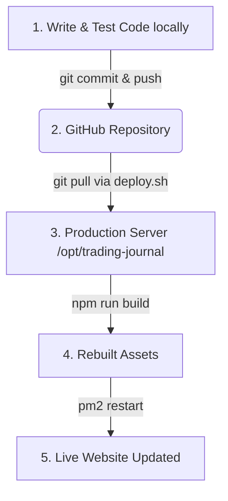

# DevOps & Deployment Guide: Trading Journal Application

This guide explains the project structure, deployment workflow, and basic process management tools (like PM2) used to keep your Trading Journal application running in production.

---

## 1. Local vs. Production Environments

For web applications, it is standard practice to separate your code into two distinct environments:

| Environment | Directory Path | Purpose | How it runs |
| :--- | :--- | :--- | :--- |
| **Local (Development)** | `/home/jackc/projects/homma-research` | Where you modify, debug, and test code. | Development servers (`npm run dev` / `flask run`). |
| **Production (Live)** | `/opt/trading-journal` | Where the live site runs (`http://192.168.0.202:3000`). | Built production bundle managed by PM2. |

> [!IMPORTANT]
> **Rule of Thumb:** Never copy-paste files manually between the local directory and the `/opt` directory. Copying files manually leads to out-of-sync configurations, untracked code changes, permission issues, and broken deployments. Always use Git to sync code.

---

## 2. The Git-Based Deployment Workflow

Instead of copying files manually, deployment uses a centralized remote repository (GitHub). Code flows from **Local Development** &rarr; **GitHub** &rarr; **Production Server**.



### Step-by-Step Command Guide

### Step-by-Step Command Guide

Run these commands in your **local terminal** (in `/home/jackc/projects/homma-research`) when you want to save your progress and send updates live:

1. **Check what has changed (Recommended first step):**
   ```bash
   git status
   ```
   *This shows you which files have been modified, created, or deleted. In this case, it will show `/components/LiveGainers.tsx` as modified, and `/docs/DEVOPS_GUIDE.md` as untracked.*

2. **Stage your files for commit (Add to git):**
   * **To add a specific new or modified file:**
     ```bash
     git add docs/DEVOPS_GUIDE.md
     ```
   * **To add multiple files individually:**
     ```bash
     git add components/LiveGainers.tsx docs/DEVOPS_GUIDE.md
     ```
   * **To add EVERYTHING that changed at once (most common):**
     ```bash
     git add .
     ```

3. **Verify what is staged (Optional but safe):**
   ```bash
   git diff --staged
   ```
   *This shows a detailed green/red text diff of the exact changes you are about to save.*

4. **Commit your changes locally:**
   Every commit needs a description message explaining the change:
   ```bash
   git commit -m "feat: improve Live Gainer UI and add DevOps guide"
   ```

5. **Push to GitHub:**
   This sends your saved commits to the remote repository so the production server can access them:
   ```bash
   git push origin main
   ```

6. **Deploy to production:**
   Run the deployment script. Since the script uses the production path (`/opt/trading-journal`), you can trigger it from anywhere:
   ```bash
   bash /home/jackc/projects/homma-research/deploy.sh
   ```

---

## 3. Demystifying the Deployment Script (`deploy.sh`)

Here is what the script does under the hood when you execute it:

```bash
# 1. Navigates to the production directory and pulls the code you just pushed to GitHub
cd /opt/trading-journal
git pull

# 2. Activates the Python virtual environment and installs new backend requirements
source backend/venv/bin/activate
pip install -r backend/requirements.txt
deactivate

# 3. Installs frontend packages and builds the Next.js production bundle
cd frontend
npx pnpm@9 install --frozen-lockfile
export NEXT_IGNORE_INCORRECT_LOCKFILE=1
export NEXT_PUBLIC_API_URL="https://homma-research.homma.casa"
npx pnpm@9 run build

# 4. Restarts PM2 to apply code updates and clear cached processes
cd /opt/trading-journal
pm2 restart ecosystem.config.js
```

---

## 4. PM2 Process Management Essentials

**PM2** is a daemon process manager that keeps your Node.js backend and frontend applications running in the background. If the app crashes, PM2 automatically restarts it.

Here are the most useful PM2 commands you should know (run these on the machine hosting the production app):

### Check status of running apps
```bash
pm2 status
# or
pm2 list
```
*Shows a table listing all applications, their online status, CPU usage, memory, and restart counts.*

### View real-time application logs
```bash
# View all logs combined
pm2 logs

# View logs for a specific app (e.g., frontend)
pm2 logs frontend

# View only the last 100 lines of logs
pm2 logs --lines 100
```
*Crucial for debugging production errors or crashes.*

### Restart applications
If you need to force a restart manually without redeploying:
```bash
# Restart all managed processes
pm2 restart all

# Restart just the frontend
pm2 restart frontend
```

### Stop/Start processes
```bash
pm2 stop frontend
pm2 start frontend
```

---

## 5. DevOps Best Practices for Beginners

*   **Always pull before you write:** If you ever edit code from another device or machine, make sure to run `git pull` on your local workspace before you start coding to avoid merge conflicts.
*   **Keep secrets out of Git:** Never check `.env` files, API keys, or private passwords into Git. Use `.env.example` as a template, and create custom `.env` files directly in `/home/jackc/projects/homma-research` and `/opt/trading-journal`.
*   **Monitor memory usage:** Use `pm2 monit` to open a dashboard in your terminal showing CPU and memory consumption.
*   **Backup database regularly:** Since your application contains trade logs, it is highly recommended to run backups of your MySQL/PostgreSQL databases (e.g., `mysqldump` or `pg_dump`) to a secure location weekly.
