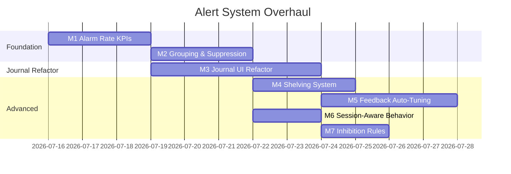

# Alert System Overhaul: Implementation Handoff Plan

> **Purpose:** Refactor the alert journal and alert engine to follow established alarm management principles (ISA-18.2, EEMUA 191, PagerDuty/Prometheus patterns). Reduce alert fatigue, add alarm KPIs, and create a continuous improvement feedback loop.
>
> **Scope:** Backend alert engine + Alert Journal UI + new alarm analytics dashboard
>
> **Key files:**
> - [stream_client.py](file:///home/jackc/projects/homma-research/momentum_screener/schwab/stream_client.py) — Alert detection & firing
> - [alerts.py (tasks)](file:///home/jackc/projects/homma-research/backend/fastapi_app/tasks/alerts.py) — Telegram formatting
> - [alerts_analytics.py](file:///home/jackc/projects/homma-research/backend/services/alerts_analytics.py) — Alert analytics service
> - [alerts.py (router)](file:///home/jackc/projects/homma-research/backend/fastapi_app/routers/alerts.py) — Alert API
> - [page.tsx](file:///home/jackc/projects/homma-research/frontend/app/alerts/page.tsx) — Alert Journal UI (1003 lines)
> - [api.ts](file:///home/jackc/projects/homma-research/frontend/lib/api.ts) — Frontend API client

---

## Industry Standards Reference

### EEMUA 191 Alarm Rate Benchmarks

| Metric | ✅ Acceptable | ⚠️ Manageable | 🔴 Overloaded |
|--------|:---:|:---:|:---:|
| Alarms/hour (avg) | ≤6 | 6–12 | >12 |
| Alarms/10min (peak) | ≤10 | 10–20 | >20 |
| Standing (unresolved) alarms | ≤5 | 5–10 | >10 |
| % Priority 1 alarms | ≤5% | 5–20% | >20% |
| Chattering alarms | 0% | <1% | >1% |

### ISA-18.2 Alarm Lifecycle

```
Identify → Rationalize → Design → Implement → Monitor → Manage of Change → Audit
```

### Key Principles Applied

1. **Every alarm must have a defined cause, consequence, response, and response time** — map to our alert types
2. **≤6 alarms/hour sustainable** — our system likely exceeds this significantly
3. **Bad actor management** — monthly top-10 noisiest alert combos reviewed
4. **State-based alarming** — suppress/adjust by market session
5. **Shelving** — temporary suppression, logged and time-limited
6. **Alert grouping** — same-ticker alerts within a window consolidated
7. **Feedback loop** — noise/helpful ratings drive parameter tuning

---

## Milestone 1: Alarm Rate KPI Tracking (Backend + DB)

> **Goal:** Measure current alarm load. Can't improve what you can't measure.

### M1.1 — New DB table: `alerts.alarm_metrics`

```sql
-- Daily/hourly alarm rate rollups, computed by a nightly Celery job
CREATE TABLE IF NOT EXISTS alerts.alarm_metrics (
    id            SERIAL PRIMARY KEY,
    metric_date   DATE NOT NULL,
    metric_hour   SMALLINT,               -- NULL = daily rollup, 0-23 = hourly
    total_alarms  INT NOT NULL DEFAULT 0,
    tier1_count   INT NOT NULL DEFAULT 0,
    tier2_count   INT NOT NULL DEFAULT 0,
    tier3_count   INT NOT NULL DEFAULT 0,
    unique_tickers INT NOT NULL DEFAULT 0,
    chattering_count INT NOT NULL DEFAULT 0,  -- alarms that fired >3x in 1 min
    peak_10min_rate  INT,                     -- max alarms in any 10-min window
    noise_count   INT NOT NULL DEFAULT 0,     -- feedback_score='noise'
    helpful_count INT NOT NULL DEFAULT 0,     -- feedback_score='helpful'
    snr_pct       NUMERIC(5,1),               -- signal-to-noise ratio
    created_at    TIMESTAMPTZ DEFAULT NOW(),
    UNIQUE(metric_date, metric_hour)
);
```

### M1.2 — New service: `services/alarm_metrics_service.py`

Functions:
- `compute_hourly_metrics(date, hour)` → Query `screener_alerts` for that hour, compute counts by tier, chattering detection, peak 10-min rate
- `compute_daily_rollup(date)` → Aggregate hourly metrics into daily row
- `get_alarm_rate_trend(days=30)` → Return time series of daily alarm rates for dashboard
- `get_bad_actors(days=30, top_n=10)` → Return top N noisiest `(alert_type, symbol)` combos by frequency
- `get_chattering_alerts(date)` → Return alerts that fired >3x in 1 min for same ticker+type

**Chattering detection query:**
```sql
SELECT symbol, alert_type, COUNT(*) as fire_count,
       MIN(alert_time) as first, MAX(alert_time) as last
FROM screener_alerts
WHERE alert_time::date = $1
GROUP BY symbol, alert_type,
         date_trunc('minute', alert_time)
HAVING COUNT(*) > 3;
```

### M1.3 — Celery task: `tasks/alarm_metrics_task.py`

- Schedule via Celery Beat: run at market close (4:15 PM ET) daily
- Compute hourly metrics for each market hour (9:30–16:00)
- Compute daily rollup
- Optional: send Telegram summary if alarm rate exceeded EEMUA thresholds

### M1.4 — New router endpoint

- `GET /api/alerts/alarm-metrics?days=30` → Return alarm rate trend data
- `GET /api/alerts/bad-actors?days=30&top_n=10` → Return top bad actors

> [!IMPORTANT]
> Router follows RFC-001: thin endpoint → calls `alarm_metrics_service` → returns JSON. No SQL in router.

---

## Milestone 2: Alert Grouping & "Already In Play" Suppression (Backend)

> **Goal:** Reduce notification volume by 40-60%. Group rapid-fire alerts for same ticker.

### M2.1 — In-memory alert grouping window

In [stream_client.py](file:///home/jackc/projects/homma-research/momentum_screener/schwab/stream_client.py), add a grouping buffer:

```python
# At class level
_alert_group_buffer: dict[str, list[dict]] = {}   # ticker → pending alerts
_alert_group_timers: dict[str, float] = {}         # ticker → window start time
ALERT_GROUP_WINDOW_SEC = 30  # Group alerts within 30s window
```

**Logic:**
1. When `check_and_fire_alert()` would fire, instead of immediately sending:
   - Add to `_alert_group_buffer[symbol]`
   - If this is the first alert in buffer for this symbol, set a 30s timer
2. When timer expires (or if a Tier 1 alert arrives — Tier 1 always fires immediately):
   - If 1 alert in buffer → send normally
   - If 2+ alerts in buffer → send a **grouped notification** showing all alerts for that ticker as one message
3. DB persistence happens immediately (every alert gets its own row), only the **notification** is grouped

### M2.2 — "Already in play" suppression

Add per-session tracking:

```python
_session_alert_counts: dict[str, int] = {}  # ticker → total alerts this session
ALREADY_IN_PLAY_THRESHOLD = 5  # After 5 alerts, suppress Tier 2/3 for this ticker
```

**Logic:**
- After a ticker has fired `ALREADY_IN_PLAY_THRESHOLD` alerts in the current session:
  - Tier 1 alerts still fire (always)
  - Tier 2/3 alerts are logged to DB but **no push notification** — marked as `suppressed_reason = 'already_in_play'`
  - Alert Journal shows these suppressed alerts with a distinct badge
- Reset counts at session boundaries (pre-market open, market open, close)

### M2.3 — DB schema change

```sql
ALTER TABLE screener_alerts ADD COLUMN IF NOT EXISTS
    suppressed_reason VARCHAR(50);  -- NULL=not suppressed, 'already_in_play', 'grouped', 'shelved', 'inhibited'

ALTER TABLE screener_alerts ADD COLUMN IF NOT EXISTS
    group_id UUID;  -- Links grouped alerts together

ALTER TABLE screener_alerts_archive ADD COLUMN IF NOT EXISTS
    suppressed_reason VARCHAR(50);

ALTER TABLE screener_alerts_archive ADD COLUMN IF NOT EXISTS
    group_id UUID;
```

---

## Milestone 3: Alert Journal Refactor (Frontend)

> **Goal:** Transform the Alert Journal from a simple log viewer into an **alarm management dashboard** with KPIs, bad actor reporting, and actionable insights.

### M3.1 — New "Alarm Health" summary bar (top of page)

Replace the current simple `"X Alerts · Y Stocks"` bar with a richer **alarm health dashboard strip**:

```
┌─────────────────────────────────────────────────────────────────────┐
│  📊 ALARM HEALTH  │  42 Alerts  │  Rate: 8.4/hr ⚠️  │  SNR: 62% │
│  T1: 3 (7%)  T2: 14 (33%)  T3: 25 (60%)  │  Chattering: 2  │     │
│  Peak 10min: 14 🔴  │  Bad Actors: NXTC×8, ABCD×6               │
└─────────────────────────────────────────────────────────────────────┘
```

- Color-code rate against EEMUA thresholds: green (≤6/hr), amber (6-12), red (>12)
- Show tier distribution as horizontal stacked bar
- Show signal-to-noise ratio from feedback data
- List top 2-3 bad actors for the day

### M3.2 — Refactor ticker sidebar with suppression indicators

Current sidebar shows: ticker, alert count, helpful/noise/unrated counts.

**Add:**
- Suppressed alert count badge (gray, with tooltip "5 alerts suppressed — already in play")
- Grouped alert indicator (shows "3 grouped into 1 notification")
- Alert rate sparkline per ticker (tiny bar showing alerts over time-of-day)
- Sort options: by alert count, by SNR, by most recent

### M3.3 — Timeline view (new view mode)

Add a toggle between current "Card View" and new "Timeline View":

```
09:31  ┣━ NXTC  HOD BREAKOUT        T1  $4.82  RVOL 12.3x  ✅ Helpful
09:31  ┣━ NXTC  VOLUME SPIKE        T2  $4.85  RVOL 12.3x  [Grouped with above]
09:33  ┣━ ABCD  RUNNING UP          T2  $2.10  RVOL 5.1x   ⏸ Suppressed (in-play)
09:45  ┣━ XYZW  VWAP RECLAIM        T2  $7.50  RVOL 3.2x   ❌ Noise
10:02  ┣━ NXTC  BULL FLAG           T1  $5.20  RVOL 8.7x   ✅ Helpful
...
```

- Horizontal timeline spanning market hours (9:30–16:00)
- Color-coded by tier
- Shows grouped/suppressed alerts with distinct styling
- Click to expand detail panel

### M3.4 — Bad Actors tab

New tab alongside "Journal" and "Performance": **"Bad Actors"**

- Shows top 10 noisiest alert type + ticker combos over last 30 days
- Each row shows: alert_type, symbol, fire count, noise%, action recommendation
- "Mute" button to shelve a specific combo
- Auto-generated insights: "VOLUME_SPIKE on sub-$2 stocks has 85% noise rate — consider raising RVOL threshold for this price bucket"

### M3.5 — Alarm Rate Trend chart

Small line chart showing daily alarm rate over last 30 days with EEMUA threshold lines drawn:
- Green zone (≤6/hr)
- Amber zone (6-12/hr)
- Red zone (>12/hr)

This gives you at-a-glance understanding of whether your system is improving or degrading.

---

## Milestone 4: Shelving System (Backend + Frontend)

> **Goal:** Allow temporary suppression of noisy alerts without permanently disabling them.

### M4.1 — DB table: `alerts.alert_shelves`

```sql
CREATE TABLE IF NOT EXISTS alerts.alert_shelves (
    id           SERIAL PRIMARY KEY,
    shelf_type   VARCHAR(20) NOT NULL,  -- 'ticker', 'alert_type', 'combo'
    symbol       VARCHAR(20),           -- NULL if shelving an alert_type globally
    alert_type   VARCHAR(50),           -- NULL if shelving a ticker globally
    reason       TEXT,
    shelved_at   TIMESTAMPTZ NOT NULL DEFAULT NOW(),
    expires_at   TIMESTAMPTZ NOT NULL,  -- Max 24h per ISA-18.2
    shelved_by   VARCHAR(50) DEFAULT 'user',
    active       BOOLEAN DEFAULT TRUE
);
```

### M4.2 — Shelving service: `services/alert_shelving_service.py`

- `shelve_alert(shelf_type, symbol, alert_type, duration_minutes, reason)` → Create shelf entry
- `unshelve(shelf_id)` → Deactivate shelf
- `get_active_shelves()` → Return all currently active shelves
- `is_shelved(symbol, alert_type)` → Check if a specific alert is shelved (called from stream_client)
- Auto-expire: `expires_at` checked on each call; cron job cleans up expired shelves

### M4.3 — Integration with `check_and_fire_alert()`

Before calling `alerts.should_fire_alert()`, check shelving:

```python
if await self._is_shelved(symbol, alert_type):
    await save_alert_to_db(...)  # Still log to DB
    # Mark as suppressed_reason = 'shelved'
    return  # Don't send notification
```

### M4.4 — Shelving UI in Alert Journal

- On each alert type row: "🔇 Shelve" button → opens mini-modal:
  - Duration: 15min / 30min / 1hr / 4hr / rest-of-day
  - Scope: This ticker only / This alert type globally / This combo
  - Reason (optional text)
- Active shelves shown as a banner at top of journal
- Shelf history visible in Bad Actors tab

---

## Milestone 5: Feedback-Driven Auto-Tuning (Backend)

> **Goal:** Close the loop — noise/helpful ratings feed back into alert parameters.

### M5.1 — Feedback analytics aggregation

New service function: `compute_feedback_stats(days=30)`

```python
# Returns per alert_type:
{
    "VOLUME_SPIKE": {
        "total": 142,
        "helpful": 38, "noise": 67, "neutral": 12, "unrated": 25,
        "noise_pct": 47.2,
        "helpful_pct": 26.8,
        "by_price_bucket": {
            "$0-2":   {"total": 45, "noise_pct": 82.0},  # ← auto-tune candidate
            "$2-5":   {"total": 52, "noise_pct": 38.5},
            "$5-10":  {"total": 30, "noise_pct": 23.3},
            "$10+":   {"total": 15, "noise_pct": 13.3},
        },
        "by_rvol_bucket": {
            "1-3x":   {"total": 60, "noise_pct": 68.3},  # ← low RVOL = mostly noise
            "3-5x":   {"total": 42, "noise_pct": 35.7},
            "5-10x":  {"total": 28, "noise_pct": 17.9},
            "10x+":   {"total": 12, "noise_pct": 8.3},
        }
    },
    ...
}
```

### M5.2 — Auto-tune recommendations engine

Based on feedback stats, generate actionable recommendations:

```python
def generate_tuning_recommendations(feedback_stats: dict) -> list[dict]:
    """
    Generate auto-tune recommendations from feedback data.
    Example output:
    [
      {
        "alert_type": "VOLUME_SPIKE",
        "recommendation": "Raise RVOL threshold from 2.0x to 3.5x for stocks under $2",
        "confidence": "high",
        "evidence": "82% noise rate for VOLUME_SPIKE on $0-2 stocks (n=45)",
        "parameter": "rvol_min",
        "current_value": 2.0,
        "suggested_value": 3.5,
        "scope": {"price_max": 2.0}
      }
    ]
    """
```

### M5.3 — Recommendations display in Bad Actors tab

Show auto-generated recommendations as cards:
- Evidence (noise %, sample size)
- Current vs suggested parameter
- "Apply" button → updates alert config via existing admin API
- "Dismiss" button → hides for 30 days

> [!TIP]
> This is the key feedback loop that makes the system self-improving over time. Rate your alerts consistently, and the system learns what's noise.

---

## Milestone 6: Session-Aware Alert Behavior (Backend)

> **Goal:** Different alarm behavior during different market phases.

### M6.1 — Define market sessions

```python
MARKET_SESSIONS = {
    "premarket":    (time(4, 0), time(9, 30)),
    "open_rush":    (time(9, 30), time(10, 0)),   # First 30 min — high noise
    "morning":      (time(10, 0), time(12, 0)),
    "midday":       (time(12, 0), time(14, 0)),    # Low activity
    "afternoon":    (time(14, 0), time(15, 30)),
    "power_hour":   (time(15, 30), time(16, 0)),
}
```

### M6.2 — Session-aware threshold multipliers

```python
SESSION_MULTIPLIERS = {
    "premarket":  {"rvol_mult": 0.8, "volume_mult": 0.5, "tier_boost": 1},
    "open_rush":  {"rvol_mult": 1.5, "volume_mult": 2.0, "tier_boost": 0},  # Harder to alert
    "morning":    {"rvol_mult": 1.0, "volume_mult": 1.0, "tier_boost": 0},
    "midday":     {"rvol_mult": 0.8, "volume_mult": 0.8, "tier_boost": 0},
    "afternoon":  {"rvol_mult": 1.0, "volume_mult": 1.0, "tier_boost": 0},
    "power_hour": {"rvol_mult": 1.2, "volume_mult": 1.5, "tier_boost": 0},
}
```

**Rationale:** During `open_rush`, everything spikes — raise thresholds so only genuinely exceptional moves trigger alerts. During `premarket`, lower thresholds since activity is sparse and signals are more meaningful.

### M6.3 — Integration point

In alert detection methods (`_check_volume_spike`, `_check_hod_breakout`, etc.), apply session multiplier to thresholds:

```python
session = get_current_session()
mult = SESSION_MULTIPLIERS[session]
effective_rvol_min = base_rvol_min * mult["rvol_mult"]
```

---

## Milestone 7: Alert Inhibition Rules (Backend)

> **Goal:** Higher-priority events suppress lower-priority ones for same entity.

### M7.1 — Inhibition rules engine

```python
INHIBITION_RULES = [
    {
        "trigger": "VOLATILITY_HALT",
        "inhibits": ["HOD_BREAKOUT", "VOLUME_SPIKE", "RUNNING_UP", "BULL_FLAG",
                     "VWAP_CROSSOVER", "VWAP_RECLAIM", "MULTI_TF_CONFLUENCE"],
        "scope": "same_ticker",
        "duration_seconds": 180,  # 3 min after halt
    },
    {
        "trigger": "VOLATILITY_RESUME",
        "inhibits": ["VOLUME_SPIKE"],  # Resume itself IS the signal
        "scope": "same_ticker",
        "duration_seconds": 60,
    },
]
```

### M7.2 — In-memory inhibition state

```python
_active_inhibitions: dict[str, tuple[set[str], float]] = {}
# ticker → (set of inhibited types, expiry timestamp)
```

Check before firing: if `alert_type in _active_inhibitions[symbol][0]` and not expired → suppress.

---

## Implementation Order & Dependencies



### Suggested execution order:

| Phase | Milestone | Est. Effort | Why This Order |
|-------|-----------|-------------|----------------|
| 1 | **M1: Alarm Rate KPIs** | 1-2 days | Must measure before improving |
| 2 | **M2: Grouping & Suppression** | 2-3 days | Biggest immediate volume reduction |
| 3 | **M3: Journal UI Refactor** | 3-4 days | Surfaces M1+M2 data to user |
| 4 | **M6: Session-Aware Behavior** | 1-2 days | Quick win, no UI changes needed |
| 5 | **M7: Inhibition Rules** | 1 day | Quick win, builds on M2 patterns |
| 6 | **M4: Shelving System** | 2-3 days | Requires M3 UI for management |
| 7 | **M5: Feedback Auto-Tuning** | 3-4 days | Requires feedback data accumulation |

---

## DB Migration Summary

All migrations go in `backend/sql/` and `momentum_screener/db/schema_schwab.sql`:

```sql
-- 1. Alarm metrics rollup table
CREATE TABLE IF NOT EXISTS alerts.alarm_metrics ( ... );

-- 2. Shelving table
CREATE TABLE IF NOT EXISTS alerts.alert_shelves ( ... );

-- 3. screener_alerts additions
ALTER TABLE screener_alerts ADD COLUMN IF NOT EXISTS suppressed_reason VARCHAR(50);
ALTER TABLE screener_alerts ADD COLUMN IF NOT EXISTS group_id UUID;
ALTER TABLE screener_alerts_archive ADD COLUMN IF NOT EXISTS suppressed_reason VARCHAR(50);
ALTER TABLE screener_alerts_archive ADD COLUMN IF NOT EXISTS group_id UUID;
```

---

## New Files to Create

| File | Purpose |
|------|---------|
| `backend/services/alarm_metrics_service.py` | Alarm rate KPI computation |
| `backend/services/alert_shelving_service.py` | Shelving CRUD + expiry |
| `backend/services/alert_tuning_service.py` | Feedback analytics + auto-tune recommendations |
| `backend/fastapi_app/tasks/alarm_metrics_task.py` | Celery task for daily metric rollup |
| `backend/sql/alarm_management_migration.sql` | All schema changes |
| `backend/tests/test_alarm_metrics.py` | Unit tests for metric computation |
| `backend/tests/test_alert_shelving.py` | Unit tests for shelving logic |
| `backend/tests/test_alert_tuning.py` | Unit tests for auto-tune recommendations |

## Existing Files to Modify

| File | Changes |
|------|---------|
| [stream_client.py](file:///home/jackc/projects/homma-research/momentum_screener/schwab/stream_client.py) | Add grouping buffer, suppression logic, inhibition checks, session-aware thresholds |
| [alerts_analytics.py](file:///home/jackc/projects/homma-research/backend/services/alerts_analytics.py) | Add `compute_daily_summary` support for suppressed/grouped fields |
| [alerts.py (router)](file:///home/jackc/projects/homma-research/backend/fastapi_app/routers/alerts.py) | Add alarm-metrics, bad-actors, shelving endpoints |
| [page.tsx](file:///home/jackc/projects/homma-research/frontend/app/alerts/page.tsx) | Full refactor: alarm health bar, timeline view, bad actors tab, shelving UI |
| [api.ts](file:///home/jackc/projects/homma-research/frontend/lib/api.ts) | New API functions + updated types |

---

## Testing Strategy

Per AGENTS.md rules:
- **Services get unit tests**: `test_alarm_metrics.py`, `test_alert_shelving.py`, `test_alert_tuning.py`
- **Router gets integration tests**: Existing `test_alerts_router.py` extended
- **Pure transforms (no DB)**: Grouping logic, session detection, inhibition engine — all unit-testable
- Run `/opt/trading-journal/backend/venv/bin/pytest -p no:anyio` after each milestone

---

## Success Criteria

After full implementation, these EEMUA-derived metrics should improve:

| Metric | Current (est.) | Target |
|--------|:-:|:-:|
| Avg alarms/hour | Unknown (likely >12) | ≤6 |
| Peak 10-min rate | Unknown | ≤10 |
| Signal-to-noise ratio | Unknown | ≥70% |
| Chattering alerts | Unknown | 0 |
| % Tier 1 alerts | Unknown | ≤10% |
| Feedback coverage | ~5% rated | ≥60% rated |

> [!NOTE]
> The first milestone (KPI tracking) will establish baselines for all of these. Without M1 data, the "Current" column is estimated.
